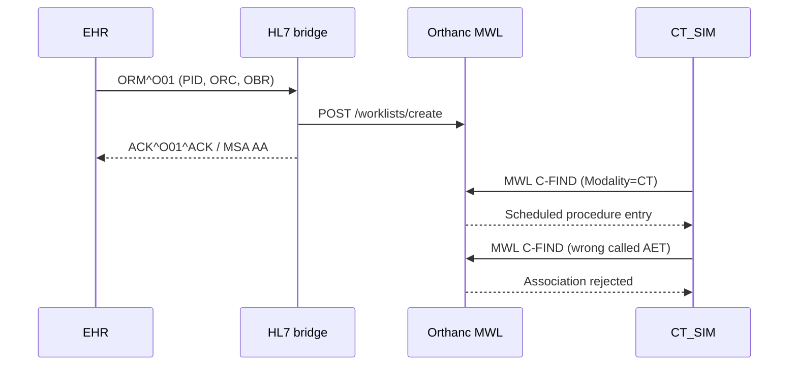

# HL7 to DICOM MWL flow

```mermaid
sequenceDiagram
    participant EHR as EHR
    participant B as HL7 bridge
    participant O as Orthanc MWL
    participant CT as CT_SIM
    EHR->>B: ORM^O01 (PID, ORC, OBR)
    B->>O: POST /worklists/create
    B-->>EHR: ACK^O01^ACK / MSA AA
    CT->>O: MWL C-FIND (Modality=CT)
    O-->>CT: Scheduled procedure entry
    CT->>O: MWL C-FIND (wrong called AET)
    O-->>CT: Association rejected
```

